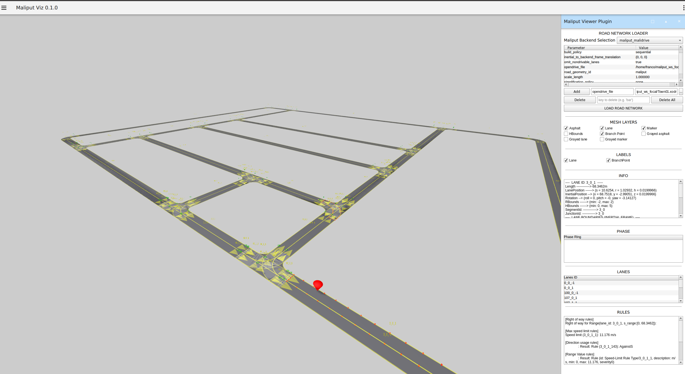
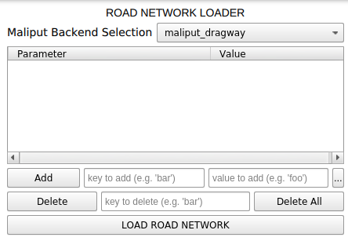
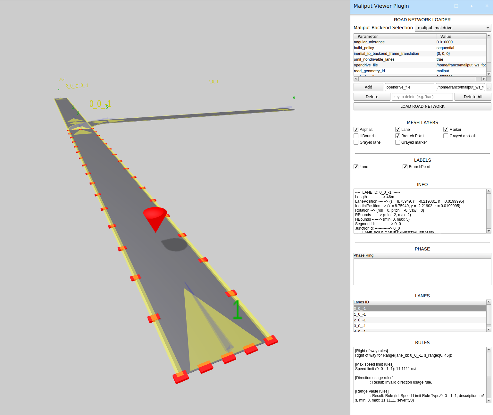

[](https://github.com/maliput/maliput_viz/actions/workflows/build.yml)

# maliput_viz

## Description

`maliput_viz` package is part of the [Maliput](https://github.com/maliput/) family.
It offers a visualizer for analyzing the road networks.

**Note**: For full information about Maliput please visit [Maliput Documentation](https://maliput.readthedocs.io/en/latest/index.html).



## How to use it

`maliput_viz` application is provided by `maliput_viz` package.

After installation simply run:
```sh
maliput_viz
```

In the top-right of the window options about the road network loading can be found:



`maliput_viz` uses the [maliput plugin architecture](https://maliput.readthedocs.io/en/latest/html/deps/maliput/html/maliput_plugin_architecture.html) for loading the maliput backends in runtime.

In general, each backend would receive a set of parameters that defines the behavior of the road network loader. For example, in the `maliput_malidrive` backend, the `opendrive_file` parameter holds the path to a `XODR` map file.

When a backend is selected, the default parameter set for it is filled up.
The user can add, edit or remove any parameter as they please.

After hitting the `Load Road Network` button, the correspondent backend will load up a maliput `RoadNetwork` and it will be displayed.



The UI provides several options for changing visibilities of the meshes and also providing useful information about several things like: lane description, rules and phases, among others.

### Demo

The following video shows a maliput Road Network being loaded using [`maliput_malidrive`](https://github.com/maliput/maliput_malidrive) backend.
Besides the XODR files for the `RoadGeometry`, also other entities are being loaded to complete the `RoadNetwork` such as: `RuleRegistry`, `RoadRulebook`, `TrafficLightBook` and `PhaseRingBook`.


## Installation

### Supported platforms

Ubuntu Focal Fossa 20.04 LTS, ROS2 Foxy.

### Binary Installation on Ubuntu

See [Installation Docs](https://maliput.readthedocs.io/en/latest/installation.html#binary-installation-on-ubuntu).

### Source Installation on Ubuntu

#### Prerequisites

```
sudo apt install python3-rosdep python3-colcon-common-extensions
```


#### Build

1. Create colcon workspace if you don't have one yet.
    ```sh
    mkdir colcon_ws/src -p
    ```

2. Clone this repository in the `src` folder
    ```sh
    cd colcon_ws/src
    git clone https://github.com/maliput/maliput_viz.git
    ```

3. Install package dependencies via `rosdep`
    ```
    export ROS_DISTRO=foxy
    ```
    ```sh
    rosdep update
    rosdep install -i -y --rosdistro $ROS_DISTRO --from-paths src
    ```

4. Build the package
    ```sh
    colcon build --packages-up-to maliput_viz
    ```

    **Note**: To build documentation a `-BUILD_DOCS` cmake flag is required:
    ```sh
    colcon build --packages-select maliput_viz --cmake-args " -DBUILD_DOCS=On"
    ```
    More info at [Building Documentation](https://maliput.readthedocs.io/en/latest/developer_guidelines.html#building-the-documentation).

For further info refer to [Source Installation on Ubuntu](https://maliput.readthedocs.io/en/latest/installation.html#source-installation-on-ubuntu)


### For development

It is recommended to follow the guidelines for setting up a development workspace as described [here](https://maliput.readthedocs.io/en/latest/developer_setup.html).

## Contributing

Please see [CONTRIBUTING](https://maliput.readthedocs.io/en/latest/contributing.html) page.

## License

[](https://github.com/maliput/maliput_viz/blob/main/LICENSE)
